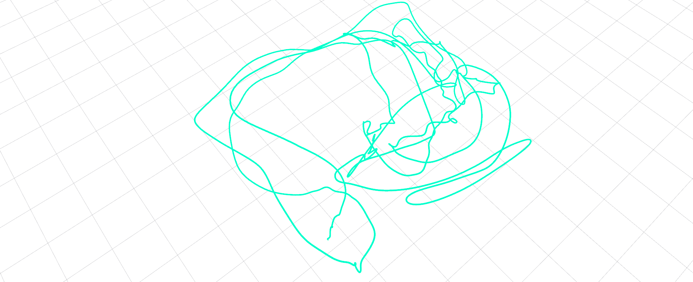

# vicon2gt

This utility was created to generate groundtruth trajectories using a motion capture system (e.g. Vicon or OptiTrack) for use in evaluating visual-inertial estimation systems.
Specifically we want to calculate the inertial IMU state (full 15 dof) at camera frequency rate and generate a groundtruth trajectory similar to those provided by the EurocMav datasets.
Please take a look at the **[REPORT](docs/report.pdf)** for specific details and a more formal description.

You will need to have a bag dataset that has the IMU, camera, and motion capture measurements of either `geometry_msgs::TransformStamped`, `geometry_msgs::PoseStamped`, or `nav_msgs::Odometry`.
If you are using the odometry topic it will use the provided covariance, otherwise it will use the one specified in the launch file.
To run please take a look at the example launch files and try them out before testing on your own dataset.
ros

## Example Outputs




```
state_0: 
m_time:[1413394882.43529]'
q:[0.0251614, -0.79553, 0.0362641, 0.604304]'
bg:[-0.00190837, 0.0243624, 0.0807357]'
v:[-0.00342677, 0.00767059, 0.0012364]'
ba:[-0.012316, 0.0955729, 0.0272365]'
p:[-1.05904, 0.429683, 1.33247]'

state_N: 
m_time:[1413394997.13767]'
q:[-0.493136, -0.636743, -0.359694, 0.471165]'
bg:[-0.00152427, 0.0255527, 0.0799344]'
v:[-0.00181216, 0.00289851, -0.00109534]'
ba:[-0.00140464, 0.0198116, 0.0590847]'
p:[-3.02558, -0.526505, 0.958149]'

R_BtoI: 
 0.301581  0.017225  0.953285
0.0239218 -0.999659  0.010495
  0.95314 0.0196392 -0.301891

p_BinI: 
 0.0789319
-0.0253601
 -0.118787

R_GtoV: 
    0.999968            0   0.00803607
-7.00472e-05     0.999962   0.00871631
 -0.00803577  -0.00871659      0.99993

t_off_vicon_to_imu: 
0.197127
```


## Frequently Asked Questions

1) *Help, doesn't converge to a good trajectory!* -- This can be caused by many things and is hard to debug. The first thing we recommend doing is to look at the optimized trajectory in RVIZ and see if the alignment there is ok. If there is issues with a noisy poses you will see it in RVIZ. In this case it is likely you will not be able to optimize the trajectory. Another source might be poor noise values, try to play with both the IMU noises and vicon pose noises. If the dataset is degenerate, you might want to try fixing the marker to IMU transform (see launch files) as if there is not enough motion this can bias the trajectory results.

2) *Do I need an initial guess of the marker body to IMU?* -- We found that on good datasets you can just set these to be an identity transformation. If you know these values you can also try fixing and not estimating them online. Additionally if there is enough rotation in the dataset the time offset usually robustly converges.

3) *The calibration seems to not converge to the same thing on different collected datasets, why?* -- We don't expect the calibration to converge to the same thing on each dataset as this is highly depends on the motion of the trajectory. If you worry about it you can try fixing it and not optimizing it, but in general even if the calibration is different the trajectory itself should still be of high quality.

4) *Do I need a camera topic?* -- No, but you need some topic to specify what timestamps you want the optimized states to be at. We recommend you specify anything lower than the IMU frequency, thus you could specify the vicon topic, or another topic.

5) *Explain the timestamps the groundtruth file has in it* -- We have two time systems in the project: vicon and inertial. The states we estimate in the optimization problem are in the IMU clock frame and the CSV file we save has timestamps in the IMU clock frame. We use an arbitrary topic timestamps to define what timestamps we will export, but all these times are still in the IMU clock frame. E.g. if we use a camera topic, the CSV will have the poses at the IMU clock time of the timestamps in this topic (i.e. if you wish to get the pose at the camera timestamp you will have an additional imu-to-camera time offset you need to worry about and is not taken into account here).

6) *What frame of reference is the groundtruth file in?* -- The saved trajectory is in the gravity aligned frame of reference with its origin located at the vicon frame and yaw set to zero. We estimate the roll pitch rotation from the vicon frame to the gravity aligned frame, and save all groundtruth orientations rotated into this gravity frame. Thus one should use either a position + yaw or SE(3) alignment method.


## Building GTSAM and Dependencies

GTSAM is the only package you need to build the others (boost, eigen3) typically come on a linux-based OS.
You can optionally install Intel TBB installed as this will allow for GTSAM multithreaded performance ([link](https://software.intel.com/en-us/articles/installing-intel-free-libs-and-python-apt-repo)).
You don't need this, but this will allow for faster optimization.
```cmd
wget https://apt.repos.intel.com/intel-gpg-keys/GPG-PUB-KEY-INTEL-SW-PRODUCTS-2019.PUB
sudo apt-key add GPG-PUB-KEY-INTEL-SW-PRODUCTS-2019.PUB
rm GPG-PUB-KEY-INTEL-SW-PRODUCTS-2019.PUB
sudo sh -c 'echo deb https://apt.repos.intel.com/tbb all main > /etc/apt/sources.list.d/intel-tbb.list'
sudo apt-get update
sudo apt-get install intel-tbb-2020.3-912
```

Then we can [build](https://gtsam.org/get_started/) [GTSAM](https://gtsam.org/build/) as normal and install it globally on our system.
Note that we use the system Eigen since we want to link with packages which also use that Eigen version.
```cmd
sudo apt install libboost-all-dev libeigen3-dev libmetis-dev
git clone https://github.com/borglab/gtsam
mkdir gtsam/build/
cd gtsam/build/
cmake -DCMAKE_BUILD_TYPE=Release -DGTSAM_USE_SYSTEM_EIGEN=ON ..
make -j6
sudo make -j6 install
echo 'export LD_LIBRARY_PATH=/usr/local/lib/:$LD_LIBRARY_PATH' >> ~/.bashrc
```


